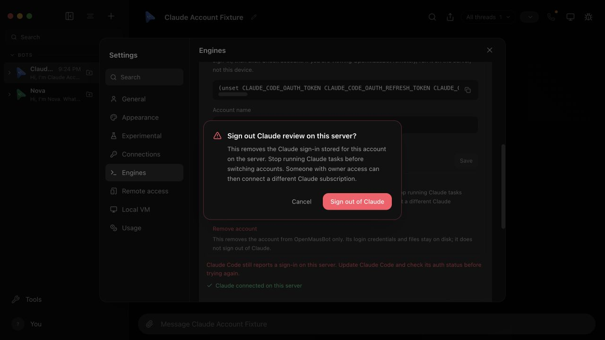

# Claude account sign-out

Use only the disposable offline fixture. It never invokes a real Claude
executable or reads a real credential store.

```sh
node --experimental-strip-types scripts/verify-claude-account.ts
```

The launcher prints its API URL, preview URL, command log, disposable home,
and `failLogoutMarker`. Run Doctor against that exact API URL, then open the
preview. In Settings → Engines, the synthetic **Claude review** account is
connected as `ada@example.test`.

1. Open **Manage account and sign-in → Sign out of Claude**. Cancel once and
   confirm the identity remains. The confirmation warns that running tasks
   are not cancelled; stop them before switching subscriptions.
2. Confirm sign-out. The fake CLI deliberately fails, leaving the account
   connected. An error must appear and the sign-out button must allow retry.
3. Remove only the printed `failLogoutMarker` inside this disposable home.
   Retry. While pending, Check account, account editing, Remove account and
   Sign out must be disabled. When complete, the identity disappears,
   **Sign-in required** appears, and the setup card offers **Sign in to Claude**.
4. Reload the preview and check the account remains signed out. The command
   log must show `auth logout` followed by `auth status --json`.
5. Close the preview and interrupt the launcher. It removes only its own
   temporary data and retains the printed server log.

The HTTP verification also checks cross-origin rejection, failed sign-out
preserving the synthetic account, successful retry, and an untouched sibling
account. Unit regressions cover a logout that ignores SIGTERM, disposal of
the controller/provider during logout, unknown auth-status results, and the
renderer using the confirmed response without a second catalog request.

```sh
pnpm exec vitest run --no-file-parallelism server/drivers/claude-login-auth.test.ts server/drivers/claude.test.ts server/provider-auth-sessions.test.ts server/request-auth.test.ts src/components/ClaudeAccountSettings.test.ts src/components/CodexAccountSettings.test.ts src/components/EnginesSettings.test.ts
pnpm typecheck
pnpm i18n:check
pnpm build
```

## UI evidence

Confirmation after a forced error; the real Settings surface remains retryable:



This offline check does not prove a real Anthropic account login or OS
credential-store operation. No provider login was used for this review.
