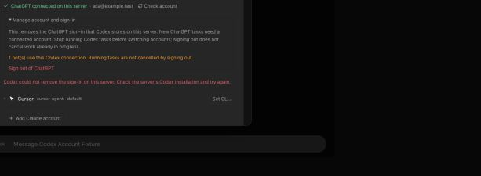

# Codex account switching

Reviewed on main `7f0c9304` plus PR #1007. All account data and executables
used here were synthetic; no live credentials or keyring were accessed.

## Run the fixture

```sh
node --experimental-strip-types scripts/verify-codex-account.ts
```

Open the printed preview URL, then Settings → Engines → Codex. The standard
verification launcher isolates the server, home, configuration, and fake CLI.
The account is `ada@example.test`, supplied by fake `account/read`, with an
empty credential directory. The script waits for Ctrl-C and cleans up.

The fixture starts with a forced-logout-error marker at the printed
`failLogoutMarker` path. Confirm sign-out: the error must be visible, the account
must remain connected, and the button must become usable again. Remove only
that disposable marker and retry. Confirm that the returned snapshot immediately
replaces the account controls with **Connect ChatGPT**, without a second catalog
request being required. Reload and confirm it remains signed out.

Before retry (the synthetic failure leaves the account intact):



After successful retry:


## Checks

- 172 tests across controller, identity, driver, auth-session, request-auth, and
  Settings suites passed; typecheck, targeted lint, locale validation, and
  renderer production build passed.
- Regressions first reproduced stale UI after successful logout, a logout that
  ignores graceful termination, and disposal leaving a logout process alive.
- Controller tests protect API-key and unknown authentication modes, preserve
  credential-home locks, and confirm signed-out status before reporting success.
- Isolated HTTP checks: cross-origin sign-out returns 403; synthetic ChatGPT
  logout returns 200 with `authenticated:false`; API-key logout is refused
  without invoking logout or removing its synthetic marker.
- Identity tests cover stale files, keyring-style responses, API-key/null modes,
  unsupported/error responses, bounded output, and process cleanup.

Identity comes from Codex's documented
[`account/read` protocol](https://learn.chatgpt.com/docs/app-server#auth-endpoints)
with `refreshToken:false`, never by decoding a possibly inactive credential
file. Unsupported CLI versions simply omit the email. Sign-out does not cancel
already-running tasks; stop them before switching accounts.
