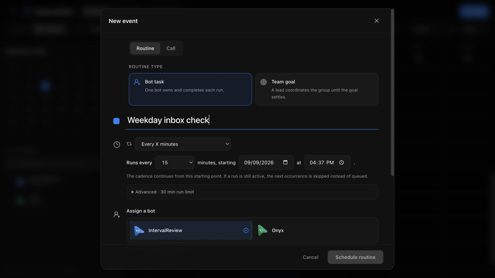
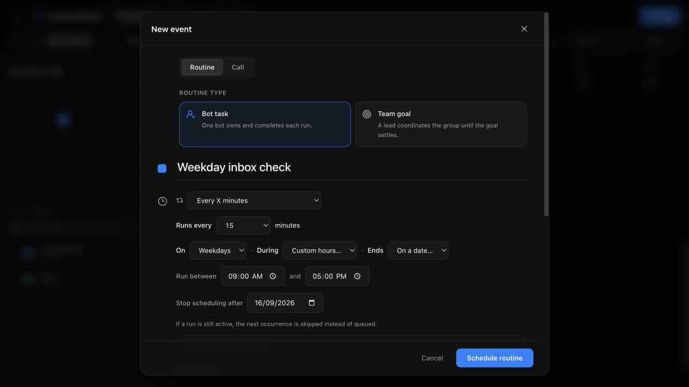

# Interval restrictions

Reviewed against main `7f0c9304` on 2026-09-09. Use the disposable server
fixture described in [routines](routines.md); never test on a live workspace.

## Checks

- 206 focused tests across routines, routine requests, agent tools, package
  import/export, calendar projection, and schedule labels passed.
- Six routine API integration cases, typecheck, targeted lint, renderer build,
  and locale validation passed after integration with main.
- A disposable server with a fake provider completed a real scheduled interval
  run restricted to the current weekday and local time window. Its recorded run
  had `manual: false`, `triggerSource: schedule`, and the expected anchor.
- Editing that routine with a legacy cadence-and-anchor-only payload preserved
  the weekday, window, and end date; explicit `null` values cleared them.
- Tests cover spring-forward/fall-back windows, queued work outside allowed
  hours, expiration, import/export, and rejecting malformed agent proposals.

## Renderer

In the isolated app, open Automations, New, Scheduled task, More options, then
choose Every X minutes. Select Weekdays, Custom hours (09:00–17:00), and an end
date. Save, reopen, and confirm that the restrictions are retained.

Before (main-equivalent renderer):

After:

Restrictions follow the scheduler computer's local timezone, matching existing
daily schedules. Time windows must end on the same day; overnight windows are
rejected. Native iOS/Android editors preserve these fields but do not yet expose
the new selectors. No paid provider or live user workspace was used.
