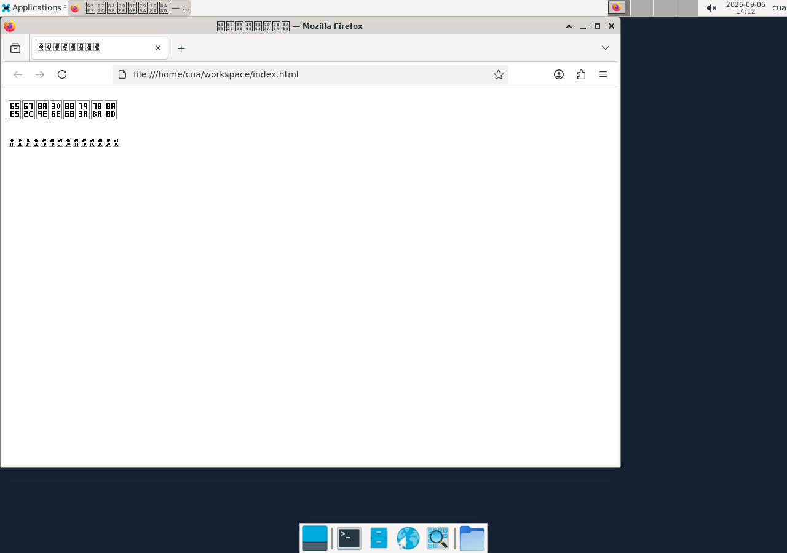
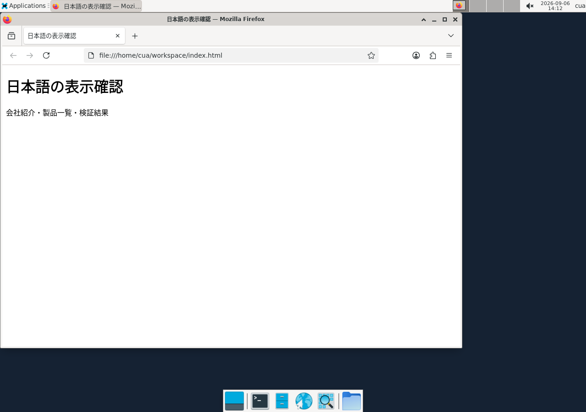

# Japanese glyphs in the managed desktop

Fixes #854. Install checksum-pinned Noto Sans CJK JP Regular and its SIL Open
Font License in the managed image before any XFCE session starts. Refresh the
system font cache during the build. Image layer version 5 makes the existing
compatibility checks detect older images; use the normal prepare/recreate flow
and retain the workspace. No automatic mutation of running desktops is added.

The unmodified font and license come from Noto CJK commit
`165c01b46ea533872e002e0785ff17e44f6d97d8`; both SHA-256 checks must pass during
the build. The license is retained at `/usr/local/share/licenses/noto-cjk/OFL.txt`
and the original font metadata is preserved. The font is 16,467,736 bytes
(15.7 MiB); the measured additional image layer, including the license and font
cache, is approximately 16.5 MB. Only the JP Regular face is added.

Installing a font after XFCE starts improved our browser content but left the
already-running window manager and panel showing missing glyphs. The new image
avoids that state from startup. These results establish a working fresh-image
path; they do not identify the exact cache responsible in an old live session.

## Reproduce in disposable desktops

Build the generated `managedImageDockerfile()` under a dedicated fixture image
tag, rather than replacing an image used by running user desktops. Set explicit
`OMB_VERIFY_PODMAN`, `OMB_VERIFY_MACHINE`, and `OMB_VERIFY_IMAGE`, then run:

```sh
node --experimental-strip-types scripts/verify-japanese-desktop.ts
```

The script saves a minimal UTF-8 HTML file, launches Firefox in two independently
created desktops, records actual screenshots and removes its containers and
engine-host temporary workspaces. Use `OMB_VERIFY_OUTPUT` for a separate evidence
directory when comparing the old image. The receipt reports capture completion;
glyph correctness requires inspecting the PNGs.

App imports use a fresh temporary HOME and data directory under the output
directory. Podman alone keeps its existing connection and SSH configuration.
Each container has a unique `omb-font-fixture-` name. The script resolves the
chosen image to an immutable local ID once, records that ID in the receipt, and
also removes partially created containers after a failed launch. It removes
temporary app data and home on normal completion or a caught failure. After a
forced process termination, remove only the exact fixture resources from that
run; do not prune the shared engine.

The fixture supplies `SYS_CHROOT` because the separate Podman Firefox issue #853
otherwise prevents browser rendering. This **test prerequisite** is applied to
both before and after captures; this font PR does not change production runtime
capabilities.

## Results, 2026-09-06

Windows/WSL2 Linux x86_64, rootless Podman 5.8.3, pinned XFCE base and Cua Driver
0.20.0. Baseline v4 selected DejaVu Sans for `fc-match :lang=ja`; the patched
image selected Noto Sans CJK JP. Actual PNGs were reviewed: page text, tab title,
XFCE window title and top-panel task title all show Japanese on both newly
created patched desktops.






- Managed image build with `--format docker`: passed, including both checksums.
- Container tests: 45 passed; server TypeScript and targeted lint: passed.
- Follow-up review reran the 45 tests, server TypeScript and targeted lint, and
  captured two more fresh desktops with the hardened fixture. Both screenshots
  show Japanese on all four surfaces. Font and license hashes were also read
  back from the built image and matched the pinned values.
- No user app data, external website or model call was used.
- Full repository tests, ARM64, other scripts/languages and other desktop images
  were not certified by this test. Noto CJK JP is a scoped Japanese coverage fix.
