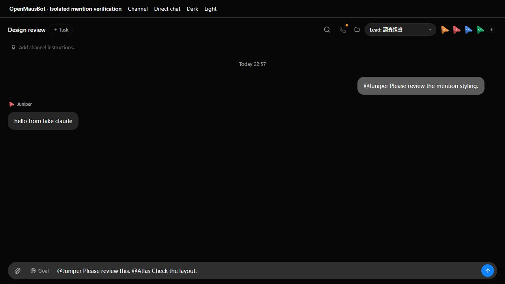
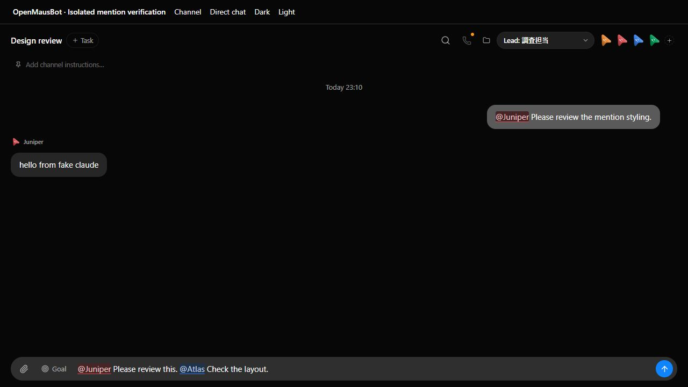
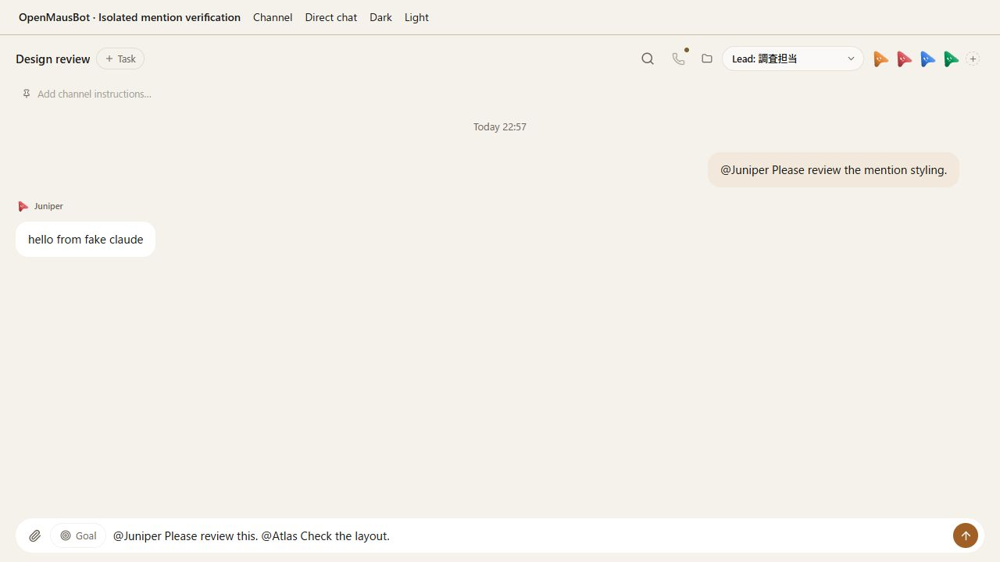
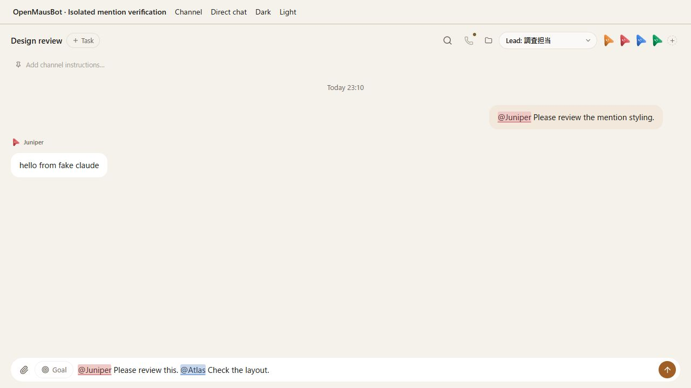

# Mention highlighting

Launch a disposable fake-engine server and the real channel/direct chat views:

```sh
node --experimental-strip-types scripts/verify-mentions.ts
```

Open the printed `previewUrl`. The fixture creates Atlas, Juniper, a Japanese-named
bot, and a Design review channel. It uses the real StoreProvider, Composer,
ChatView and GroupView. No live account, provider, or user data is used. Ctrl-C
stops the fixture servers and removes their temporary data directory.

## QA inventory

| Path | Check | Evidence |
| --- | --- | --- |
| Channel composer | Type `@Jun`, choose Juniper with Tab, append ordinary text, send with Enter | The selected name stays highlighted; the channel settles with Juniper's fake-engine reply |
| Candidate keyboard controls | Type `@`, move with ArrowDown, select the Japanese name with Enter; Escape dismisses the picker | The native textarea keeps the selected name and caret |
| Multiple mentions | Enter `@Juniper Please review this. @Atlas Check the layout.` | Both complete names highlighted in the draft |
| Japanese and everyone | Enter `@調査担当 確認して`, Shift+Enter, then `@everyone 確認して` | Both names highlighted in a channel; newline retained |
| Negative matches | Enter `me@Juniper.test @Ghost @Juniper2 @調査担当 確認して` | Only the Japanese bot is highlighted |
| Long draft | Paste 12 lines, choose Display in chat box, scroll inside the textarea and edit at the end | Mirror and textarea widths, wrapped heights and scroll offsets agree; 12 mentions retained |
| Direct chat | Switch to Direct chat; select Juniper by mouse and send | User bubble highlights the mention and the task settles |
| Direct chat scope | Enter `@everyone @Atlas @Juniper` in Atlas's direct chat | Only Juniper is highlighted |
| Responsive draft | Resize from desktop to 390px with the multiple-mention draft | Input grows to three lines; mirror and textarea both measure 80px |
| Skins | Switch Dark → Light → Dark | Names remain legible in the composer and sent bubbles |
| Bot identity colors | Compare Juniper (red) and Atlas (blue) with their avatars | Each mention uses its bot's MAUS_COLORS value; everyone remains neutral |
| Markdown | Run ChatMarkdown tests | Prose/lists/tables highlight known names; code, links and HTML safety are preserved |

## Recorded run

### Current-main RTL integration (2026-09-09)

Rebased all six original commits onto upstream `922715f0` (0.1.69), preserving
the newer translated composer labels, BotAvatar rendering, Markdown code-block
controls, thread controls and per-block/per-line bidi behavior. Each original
commit now has its author's Signed-off-by trailer.

Before the fix, an Arabic-first draft had an LTR/isolate mirror but an
RTL/plaintext native textarea. Forwarding `dir` to the mirror and applying
`unicode-bidi: plaintext` makes each paragraph follow the native input. Arabic
and Hebrew lines align right while an English line between them aligns left.
Both nodes measured 540px wide and 80px high for the three-line draft; changing
the first line from Arabic to English switched both computed directions
together. Known Bot colors and Unicode-negative matches were also checked.

The actual composer send settled, with the mixed-script text preserved in the
user bubble and colored mentions in the fake-engine reply. Evidence:
[before](evidence/mentions/rtl-before.png),
[after](evidence/mentions/rtl-after.png),
[sent/light](evidence/mentions/rtl-sent-light.png),
[DOM](evidence/mentions/rtl-dom.json),
[wait](evidence/mentions/rtl-wait.json), and
[transcript](evidence/mentions/rtl-messages.json).

```sh
node --experimental-strip-types scripts/verify-mentions.ts --bot-mentions
# Open the printed previewUrl, fill the real composer with these three lines:
# مرحبا @Atlas راجع هذا
# English @Juniper review this
# שלום @調査担当 תודה
# Capture before/after and press Enter to send.
node --experimental-strip-types scripts/control-omb.ts channels --url http://127.0.0.1:20657
node --experimental-strip-types scripts/control-omb.ts wait --channel 18b5bfe7-deb0-4962-b3b4-414e9ab90492 --timeout 60 --url http://127.0.0.1:20657
node --experimental-strip-types scripts/control-omb.ts messages --channel 18b5bfe7-deb0-4962-b3b4-414e9ab90492 --limit 20 --url http://127.0.0.1:20657
```

Printed log:
`%TEMP%/openmausbot-verification-evidence/server-1788957885515-22688.log`.
As always, fresh runs must use their own printed URL and returned channel ID.
The 65 focused tests (including direction forwarding, existing bidi controls,
mention rendering and cloudflared retries), typecheck, production renderer
build and targeted oxlint passed. The two Windows symlink EPERM tests were
rechecked on unmodified `922715f0` and both still fail there.

### Earlier verification on 0.1.61

Verified on Windows in Chromium on 2026-09-07 against upstream `9c681f44`
(0.1.61) and the mention-highlight change. Both channel and direct-chat `wait`
results were `settled`; bounded transcripts are in `evidence/mentions/`.
Long-draft checks measured matching 584px scroll heights and 440px scroll
offsets for the textarea and mirror. Editing while scrolled retained alignment.
The 390px check covers the composer; the existing channel header still overflows
at that width. A development-only createRoot warning occurred during fixture
hot replacement; the final screenshots were taken after a full reload.

Final local checks: typecheck, renderer build, lint (existing warnings), the skin
contrast check, 27 focused tests, 8 broker tests and packaged-server smoke passed.
The full Vitest run completed with 3,827 passed, 2 failed, 107 skipped and 1 todo.
Both failures were Windows `symlinkSync` EPERM in `server/message-file.test.ts`
and `server/turn-images.test.ts`; the same tests failed on unmodified `9c681f44`.
The separate Electron suite had 138 passed, 2 failed and 6 skipped. Both AppImage
installer failures require the missing POSIX `mv` command and also reproduced
on unmodified `9c681f44`. These checks therefore do not claim a fully green
Windows suite. The final fresh browser session emitted no console errors.

The bot-color follow-up passed all 789 renderer tests, typecheck, the renderer
build and targeted lint. The shared avatar palette now supplies each mention's
foreground tint, background tint and underline; a color change is reflected in
plain text and Markdown. All 70 bot-color/skin combinations were checked with
the CSS sRGB mixing ratios: the lowest text contrast was 6.24:1. Dark/light
screenshots and the settled channel transcript were refreshed for this version.
The server/Electron full-suite results above are from the preceding revision;
that full suite was not repeated for this renderer-only color follow-up.

### Multiple-bot color isolation

The follow-up browser run used Atlas (blue), Juniper (red) and 調査担当 (orange)
in one message, then repeated them in reverse order on a new line, followed by
neutral `@everyone` and unrecognized `@Ghost`. Drafts and sent messages retained
each bot's palette in both dark and light themes. Ordinary text remained the
theme's normal text color. Five DOM snapshots, each containing seven mentions,
matched the expected per-name palette; the browser reported no console errors.
The channel settled with fake-engine replies. The corresponding regression test
mixes all ten palette colors with repeated/reversed names and reversed roster
order in both MentionText and ChatMarkdown. All 26 focused tests, typecheck and
targeted lint passed; no additional production-code change was needed.

Evidence: [dark screenshot](evidence/mentions/multi-bot-dark.png),
[light screenshot](evidence/mentions/multi-bot-light.png),
[computed styles](evidence/mentions/multi-bot-dom.json),
[wait](evidence/mentions/multi-bot-wait.json) and
[transcript](evidence/mentions/multi-bot-messages.json).

Run details (2026-09-07, isolated API `http://127.0.0.1:21621`, renderer
`http://127.0.0.1:5173/__mentions.html`):

```sh
node --experimental-strip-types scripts/verify-mentions.ts
node --experimental-strip-types scripts/control-omb.ts channels --url http://127.0.0.1:21621
# Fill the real channel composer with the following three lines, switch Light,
# and press Enter. Refill the same draft after sending for screenshot comparison.
# @Atlas first. @Juniper second. @調査担当 third.
# @調査担当 reverse. @Juniper again. @Atlas last.
# @everyone neutral. @Ghost plain.
node --experimental-strip-types scripts/control-omb.ts wait --channel ec952c04-4e41-4a13-ba87-8c79b3137c05 --timeout 60 --url http://127.0.0.1:21621
node --experimental-strip-types scripts/control-omb.ts messages --channel ec952c04-4e41-4a13-ba87-8c79b3137c05 --limit 20 --url http://127.0.0.1:21621
```

The printed server log was
`%TEMP%/openmausbot-verification-evidence/server-1788790736762-24868.log`.
Fresh runs must use their own printed URL and channel ID.

### Review fixes and mentions authored by bots

The review follow-up rejects Unicode letters, numbers, combining marks and
underscores following a recognized name. Tests include `@調査担当者`,
`@everyone調査`, supplementary-plane characters and exact longer roster names.
`@everyone` is channel-only in the picker, composer, user bubbles and bot
Markdown. The stylesheet also includes the requested declaration separator.

Launch with `--bot-mentions` to script the existing fake CLI through the
launcher's `FAKE_CLAUDE_*` environment. Its first reply mentions Juniper, 調査担当 and Atlas;
subsequent replies use the default text to bound channel handoffs. Send
`@Atlas Please ask the team to review.` through the channel composer. In the
recorded run, Atlas's actual bot message highlighted Juniper red, 調査担当 orange
and Atlas blue; repeated mentions retained those colors in both themes. The
two Unicode prefixes stayed plain, and channel `@everyone` stayed neutral.

The `DM renderer preview` button renders the same fixture transcript with
`group.dm = true`, exercising real GroupView/Composer components without
creating a bot-to-bot server conversation. In this preview, `@everyone` had no
highlight in the bot reply or draft, and typing `@every` offered no candidate.
This preview checks DM rendering only; no message was sent from that preview.

```sh
node --experimental-strip-types scripts/verify-mentions.ts --bot-mentions
node --experimental-strip-types scripts/control-omb.ts channels --url http://127.0.0.1:21580
# In the printed previewUrl, fill the channel composer with
# @Atlas Please ask the team to review.
# and press Enter.
node --experimental-strip-types scripts/control-omb.ts wait --channel 2ee9e176-5270-4211-9968-af5baa0eef39 --timeout 60 --url http://127.0.0.1:21580
node --experimental-strip-types scripts/control-omb.ts messages --channel 2ee9e176-5270-4211-9968-af5baa0eef39 --limit 20 --url http://127.0.0.1:21580
```

Recorded on 2026-09-07; printed log:
`%TEMP%/openmausbot-verification-evidence/server-1788791336713-2520.log`.
The channel settled. Evidence: [wait](evidence/mentions/bot-reply-wait.json),
[transcript](evidence/mentions/bot-reply-messages.json),
[DOM palettes](evidence/mentions/bot-reply-dom.json),
[dark screenshot](evidence/mentions/bot-reply-dark.png) and
[light screenshot](evidence/mentions/bot-reply-light.png).
All 792 renderer tests (102 files), typecheck, renderer build and targeted
oxlint passed. The full server/Electron suite was not repeated for these
renderer and fixture changes.

The fixture verifies browser renderer behavior and fake-engine message handling.
It does not establish packaged Electron, Safari, operating-system IME candidate
windows, or real-provider delegation behavior. Mention decoration uses the current
roster; historical names no longer in that roster stay plain text.

| Skin | Before | After |
| --- | --- | --- |
| Midnight |  |  |
| Atelier |  |  |
