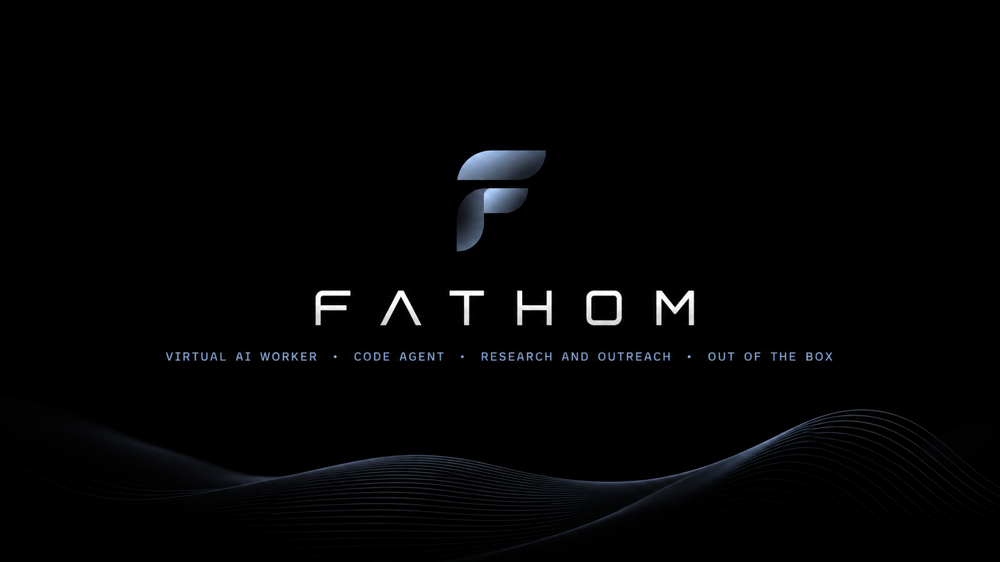

<p align="center">
  
</p>

<p align="center">
  <strong>Fathom</strong>
  <strong>— universal autonomous AI worker. Research, outreach, code, computer use — any task, autonomously.</strong>
</p>

<p align="center">
  <a href="#"></a>
  <a href="#"></a>
  <a href="#"></a>
</p>

---

**Fathom** is a self-hosted Rust runtime for autonomous remote AI workers. Give it a natural-language task and it can plan, delegate to hierarchical sub-agents, use tools, persist state, and deliver results through the interface you choose. **Research is one workflow** alongside code and data work, browser/computer tasks, recurring operations, and other tasks your configured tools and model can support.

> Coordinators plan; workers execute; analysts and verifiers can cross-check; writers can produce a final deliverable. The runtime keeps the work observable and controllable rather than presenting a hosted service.

Deploy the binary locally or on a server you control. Run workers through the CLI or TUI, expose the HTTP API with SSE and the AG-UI compatibility stream, connect external clients through MCP, or keep work durable with jobs and schedules. Optional memory, governance and audit, encrypted credentials, notifications, replay, observability, and the Playwright computer service extend the runtime when configured.

## How it works

1. **Submit** a natural-language task through the CLI, TUI, HTTP API, durable job, or a configured schedule.
2. **Plan** — a coordinator decomposes the task and can spawn hierarchical sub-agents (`spawn_agent`).
3. **Execute** — workers use the tools available in the registry: web and data tools, files and shell, code analysis, optional browser/computer services, MCP tools, and more.
4. **Control** — operators can observe events, steer a run, answer questions, and approve configured side effects through the TUI or HTTP control plane.
5. **Persist** — sessions, jobs, contacts, and (when enabled) long-term semantic memory are stored locally in the configured persistence layer.
6. **Deliver** — a run can write Markdown findings and configured exports, update contacts, or send notifications when those integrations are configured.

Unlike a single-shot LLM prompt, Fathom treats work as an **ongoing, parallel process**: it can branch into sub-agents, coordinate tool calls, persist progress, and stream events to the TUI, HTTP/SSE clients, or job logs. Exact capabilities depend on the configured model, tools, credentials, and optional services.

## Capabilities

| Area | What Fathom can do |
|------|--------------------|
| **Universal work** | Natural-language tasks, coordinator planning, hierarchical delegation, parallel tool execution, durable sessions and jobs |
| **Research workflow** | Search/fetch/crawl, extraction, OSINT and lead generation when the relevant tools and provider credentials are configured |
| **Code and data** | File editing, shell, Git, AST code analysis, Python/Node execution, parsing, and structured outputs |
| **Interfaces** | CLI, ratatui TUI, HTTP REST, SSE events, a read-only AG-UI compatibility bridge, and MCP client/server |
| **Remote operations** | Self-host on a server; use coworkers, channels, schedules, jobs, notifications, and session resumption |
| **Safety and state** | Optional governance policies and audit, encrypted credentials, replay/observability, and long-term semantic memory |
| **Computer use** | Optional Playwright loopback service and Docker supervisor for isolated per-agent browser work |

## Runtime shape

Fathom is a 12-crate Rust workspace with a CLI binary. The runtime is deliberately self-hosted: you choose the LLM-compatible endpoint, credentials, persistence paths, network exposure, and optional services. See [ARCHITECTURE.md](docs/ARCHITECTURE.md) for crate boundaries and [INSTALLATION.md](docs/INSTALLATION.md) for deployment patterns.

Performance depends on hardware, model endpoint, network, configuration, and workload; this README does not present benchmark or test-count claims as product guarantees.


### 01 · Hierarchical sub-agents — tree of agents, broadcast bus, parallel execution

When you submit a task, Fathom doesn't just feed it to a single LLM call. A **coordinator agent** first analyzes the request, decomposes it into discrete sub-tasks, and spawns **worker agents** via the `spawn_agent` tool. Each worker can itself spawn child agents (depth-limited to prevent runaway recursion), forming a live tree of agents that work in parallel.

Under the hood, this is powered by a **`JoinSet`-based runtime**: every spawned agent runs as a tokio task, and the coordinator awaits their results concurrently. Communication happens over a **broadcast message bus** — agents emit typed events (plans, findings, errors, completions) that any parent or sibling can subscribe to. Background agents deliver results as structured notifications rather than blocking the parent.

The architecture is designed for **branching work**: one branch searches the web, another scrapes specific pages, a third edits code, a fourth operates a browser — all simultaneously. The coordinator merges results, detects conflicts, and hands off to analyst or verifier agents as needed.

### 02 · 7 search backends, one unified interface

Fathom can expose configured search backends through a single `web_search` interface. Which backends are available depends on the enabled features, endpoint configuration, and credentials; no provider or coverage guarantee is implied.

Two operation modes give you control:

- **Hybrid mode** — queries all backends simultaneously and merges results, deduplicating and ranking by relevance. This maximizes coverage for broad research.
- **Smart mode** — analyzes the query type (news, company research, academic, technical) and selects the optimal backend. For example, Exa for neural semantic search, Tavily for real-time news, DuckDuckGo for lightweight fallback without API keys.

Each backend returns structured results with titles, snippets, URLs, and metadata. The tool normalizes these into a common schema, so agent code never touches backend-specific formats.

### 03 · OSINT / Lead generation — extract, deduplicate, enrich, push to CRM

Fathom is built for **open-source intelligence (OSINT)** and **lead generation** workflows. Given a target profile or company description, it extracts:

- **Email addresses** — from web pages, social profiles, and public directories, with format validation
- **Phone numbers** — international format parsing and verification
- **Social profiles** — LinkedIn, GitHub, Twitter, Facebook, Telegram, and more
- **Company info** — name, domain, industry, HQ location, funding, technologies used
- **Role/position** — job titles, department, seniority level

All extracted contacts are written to a **deduplicated contact database** (SQLite locally, PostgreSQL for production) via the `save_contacts` tool. The dedup pipeline uses fuzzy matching on name + domain to avoid duplicates across runs.

When a CRM adapter is configured, contacts can be pushed with `contacts push-crm`; availability and field mapping depend on that adapter's configuration. Without a configured CRM, contacts remain in the local persistence store.

**Goal Mode** is the crown jewel of OSINT workflows. An LLM judge evaluates the completeness of gathered data against a goal specification (e.g., "find CEO email and LinkedIn at Acme Corp"). If the goal is unmet, the system runs **gap-filling rounds**: the judge identifies what's missing, and agents re-focus their search on the gaps. This continues until the goal is satisfied or the maximum round limit is reached. The result is a structured report showing what was found, what's still missing, and the confidence level for each field.

### 04 · Extensible tool registry

Fathom ships with **51 always-registered tools**, plus up to **5 CDP browser tools** and **6 computer-use tools** when their services are available. All are managed through a central **tool registry** with typed schemas, validation, and automatic documentation generation.

**Tool categories:**

| Category | Tools |
|---|---|
| **Web search** | `web_search`, `web_fetch`, `web_crawl`, `web_feed` |
| **Browser (CDP)** | `browser_navigate`, `browser_click`, `browser_type`, `browser_extract`, `browser_screenshot` |
| **Computer use** | `computer_snapshot`, `computer_navigate`, `computer_click`, `computer_type`, `computer_key`, `computer_screenshot` |
| **File system** | `file_read`, `file_write`, `file_edit`, `glob`, `grep` |
| **Shell** | `shell` (sandboxed) |
| **Code analysis** | `code_symbols`, `repo_map` (AST-based codebase understanding) |
| **OSINT** | `verify_email`, `suggest_emails`, `verify_phone`, `verify_social_profile`, `search_social`, `search_business_directory`, `find_leads`, `enrich_company`, `enrich_person`, `extract_contacts`, `parse_corporate_site`, `search_news` |
| **Memory** | `memory_absorb`, `memory_search`, `memory_digest`, `memory_boost`, `memory_link`, `memory_graph`, `memory` |
| **Data** | `parse_html`, `extract_json` |
| **Vision** | `analyze_image` (image understanding via LLM) |
| **Git** | `git_status`, `git_diff`, `git_log`, `git_add`, `git_commit`, `git_push` |
| **PDF** | `pdf_extract` |
| **REPL** | `python_exec`, `node_exec` (interactive runtimes) |
| **Contacts** | `save_contacts` |
| **Agent control** | `spawn_agent`, `question`, `skill`, `scratchpad`, `undo` |
| **Coordination** | `hub`, `daemon` |

Each tool declares its JSON schema, a natural-language description, and cost/rate-limit metadata. The LLM sees these schemas as tool definitions and can invoke any tool in the same turn. Tool dispatch overhead is ~0.75 µs per call — negligible even in complex chains.

### 05 · Computer use (Playwright) — a real browser the agent operates

Beyond headless CDP scraping, Fathom can **operate a full real browser** — a loopback Playwright service (`apps/computer`) that controls a persistent Chromium profile:

- **Accessibility-tree snapshots** with opaque refs — the agent "sees" the page like a screen-reader and interacts via refs, never brittle CSS.
- **Multiple tab-scoped snapshots**, stale-ref rejection, `navigate` / `click` / `type` / `key` / `screenshot`.
- **Screen streaming** (`/screen` WebSocket) and **human takeover** over `/control/ws` — a human can grab control at any time to unblock the agent.
- **Confined file workspace** — bounded, path-confined reads/writes.

**Browser egress is guarded**: localhost, private, link-local, multicast, and metadata targets are rejected by default. `COMPUTER_ALLOW_PRIVATE_HOSTS=true` is for local development only and never bypasses metadata/multicast denies.

With `crates/supervisor` and Docker, Fathom provisions **one isolated computer per agent** — persistent workspace/profile volumes, loopback ports, restrictive capabilities, health checks.

### 06 · Governance & safety — policy engine, audit trail, encrypted secrets

Fathom's agent runtime is **governed by an explicit policy engine** (`crates/governance`):

- **Allow/deny rules** on tool + target (e.g., allow `browser.*` on `example.com`, deny `browser.type` on `/admin/*`). Deny wins; an empty or unmatched policy **fails closed**.
- **Every tool call is authorized** before execution; redacted authorization events are persisted to an immutable audit trail (`/api/v1/governance/audit`, `/api/v1/governance/decide`).
- **Credentials vault** — secrets are stored AES-256-GCM encrypted via `/api/v1/credentials`; list responses never include plaintext, and there is **no secret-input tool** in the agent registry. Operators enter secrets through the UI; the relay adds an `x-fathom-operator` claim.
- Secret-like values are redacted before audit persistence.

### 07 · Coworkers & schedules — autonomous recurring workers

Fathom can run as **persistent remote employees**:

- **Coworkers** are durable profiles (persisted in SQLite) — each with its own identity, goals, and optional linked Fathom session / channel.
- **Channels** link coworkers to surfaces (CLI, HTTP, messaging) where they can be addressed.
- **Schedules** trigger coworker runs on cron-like timers (`/api/v1/schedules`), **atomically claimed** so concurrent runners never execute the same task twice.
- **Notifications** deliver results to configured symbolic channels (Telegram, email, webhooks).

### 08 · Long-term semantic memory — hybrid search, entity graph, absorb pipeline

Fathom's memory system persists knowledge across sessions, building a growing knowledge base from every run. It's powered by a **hybrid search engine** combining:

- **Vector similarity** (embeddings via the configured LLM) — for semantic search ("companies that use Rust")
- **BM25 text ranking** — for keyword precision ("CEO email Acme Corp")
- **Reciprocal rank fusion** — merging both rankings into a single result set

The **absorb pipeline** processes new facts before storage:

1. **Deduplication** — fuzzy matching against existing facts by content hash and semantic similarity
2. **Supersedes/contradicts chains** — if a new fact supersedes an old one (e.g., updated job title), the old fact is marked as superseded, preserving provenance
3. **Secret detection** — regex-based scanning for API keys, passwords, and tokens; flagged facts are stored with restricted access
4. **Entity extraction** — people, organizations, locations, and roles are extracted and linked

The **entity graph** stores typed relationships between entities: `works_at`, `leads`, `reports_to`, `invests_in`, `competes_with`, and custom relation types. The `memory_graph` tool returns subgraph visualizations showing connections between entities.

**Digest** runs before each session: the system summarizes the most relevant facts from memory into the agent's context window, giving it a running-start knowledge of the domain. **GC** periodically prunes stale run-scoped facts (configurable TTL, default 30 days) and merges duplicate entity records.

Memory operations are fast: absorb takes 94–1020 µs per fact, hybrid search at 1K facts runs in 1.6–2.3 ms, and a full digest completes in ~4.8 ms.

### 09 · Durable background jobs — survive restarts, retry, full HTTP API

Long-running tasks don't need to block the terminal. Fathom's **durable job system** lets you submit, monitor, and manage asynchronous operations.

```
fathom jobs submit "Analyze market X"
fathom jobs list
fathom jobs status <id>
fathom jobs logs <id>
fathom jobs cancel <id>
fathom jobs rerun <id>
```

Jobs are **SQLite-backed** — they survive process restarts, server reboots, and crashes. The scheduler uses **attempt-count retries with exponential backoff**: if a job fails, it's retried up to the configured limit with increasing delays. From the second attempt on, the agent receives the original task **plus the previous failure** — so it can diagnose its partial workspace and fix its own mistake instead of blindly rerunning.

Each job tracks its full lifecycle: `queued → running → completed / failed / cancelled`. The job log captures every agent event, tool call, and output chunk, streamable via `jobs logs`.

### 10 · MCP (Model Context Protocol) — client and server

Fathom implements the **Model Context Protocol** (MCP), making it both a consumer and provider of MCP-compatible tools.

**MCP Client** — Fathom agents can connect to external MCP servers over **stdio**, **HTTP**, or **OAuth2** transports. This means any tool exposed by an external MCP server (a database query tool, a Slack notifier, a custom API wrapper) becomes available to Fathom agents as if it were a built-in tool. The MCP client handles:

- Transport negotiation and lifecycle management
- Tool discovery and schema caching
- Automatic reconnection on transport failure
- OAuth token refresh for authenticated servers

**MCP Server** (`mcp-serve`) — Fathom can expose its whole toolbox to external MCP clients. Run `fathom mcp-serve` and any MCP-compatible host (IDE agents, automation platforms, other AI systems) can connect and use it. This turns Fathom into an **agent backend** for other AI tools.

### 11 · HTTP API + dashboard — real-time streaming, steering, approvals, observability

Fathom's HTTP server is built on **Axum** with a full REST API, real-time event streaming, and operational controls.

**API features:**

- **Authentication** — optional API-key authentication; non-loopback binds require `FATHOM_API_KEYS`.
- **Rate limiting** — per-key and per-IP rate limiting with configurable windows (`FATHOM_RATE_LIMIT`).
- **Prometheus metrics** — `/metrics` endpoint exposing tool call counts, latency histograms, agent spawn rates, memory hit rates, and error counters.
- **SSE streaming** — `/api/v1/sessions/:id/events` and `/api/v1/events` expose agent events to connected clients. **AG-UI** (`/api/v1/ag-ui/events`) provides a read-only, versioned compatibility stream with bounded reconnect replay via `Last-Event-ID`.
- **Mid-run steering** — `POST /api/v1/sessions/:id/steer` lets you inject instructions into a running session.
- **Approval endpoints** — configured tools can require approval; the server pauses, emits an approval request via SSE, and waits for the corresponding `/api/v1/sessions/:id/approve` endpoint before proceeding.
- **Question/answer** — agents emit questions mid-run via the `ask_user` mechanism.
- **Coworkers / channels / schedules / credentials / replay / observability** — full lifecycle management of autonomous workers under `/api/v1/…`.
- **Computer relay** — `/api/v1/computers/:agent_id/*` proxies the computer service (snapshot, click, type, key, screen, files, control) and routes to the right Docker container per agent.

The built-in HTTP dashboard and optional desktop/web applications can consume the runtime's API and event streams. Their available controls depend on the configured server features; the core runtime remains usable from the CLI, TUI, HTTP API, or MCP.

### 12 · TUI (ratatui) — interactive tree view, live streaming, session replay

For terminal-first users, Fathom provides a full **TUI** built with **ratatui**.

**TUI features:**

- **Tree view** — the full agent hierarchy as an interactive tree: role, status, token count, elapsed time per node.
- **Token sparkline** — real-time token consumption per agent, so you spot runaway agents before they hit budgets.
- **Live streaming** — select any agent node to see its output stream in real-time.
- **Session replay** — saved sessions replayed in the TUI, stepping through the timeline at your own pace.
- **Color-coded roles** — coordinators blue, researchers green, analysts yellow, verifiers red, writers cyan.

### 13 · Context management — token budgets, stall detection, compaction, CJK-aware

LLM context windows are the bottleneck of any agent system. Fathom's context management subsystem ensures you get the most out of every token.

**CJK-aware token counting** — uses `tiktoken-rs` with configured encoding (cl100k_base by default).

**Tool output truncation** — large tool results are truncated intelligently (keep head/tail, strip redundant whitespace and HTML), CJK-aware and word-boundary respecting.

**Hermes-style compaction** — conversation history is condensed into LLM-generated summaries, replacing older turns while preserving semantic continuity.

**Per-session token budgets** — default 128K tokens; near exhaustion the system enters "economy mode" (fewer branches, shorter outputs, aggressive compaction).

**Stall detection** — agents silent for a configurable period are warned, then killed and reported to their parent.

## Quick start

```bash
# Build from source
cargo build --release

# Run any natural-language task (research is one workflow)
./target/release/fathom run "Your task" --output ./results/

# Interactive TUI — tree view of live agents, token sparklines, session replay
./target/release/fathom tui

# HTTP API server — REST endpoints, SSE events, AG-UI compatibility stream
./target/release/fathom serve --port 8080

# MCP server — expose the registered tool set to external MCP clients (IDE agents, other AI)
./target/release/fathom mcp-serve

# Semantic memory — search, inspect, and manage the knowledge base
./target/release/fathom memory search "CEO email at Acme"
./target/release/fathom memory stats

# Contacts — list, deduplicate, or push to CRM
./target/release/fathom contacts list
./target/release/fathom contacts push-crm

# Background jobs — submit, monitor, cancel, rerun durable research tasks
./target/release/fathom jobs submit "Analyze market X"

# Profiling — personas for different kinds of work (hunter, analyst, validator…)
./target/release/fathom profiles list
```

## OSINT / outreach example

```bash
./target/release/fathom run \
  "Find contacts of executives (CEO, CTO) at IT companies in Moscow. \
   Extract emails, phones, LinkedIn profiles." \
  --output ./leads/
```

This illustrates research as one workflow: the coordinator can decompose the request, available search and OSINT tools can gather contacts, and results can be saved to the configured contact store. Verification, CRM sync, and additional gap-filling depend on the enabled tools and configuration; they are not guaranteed by the command alone.

## Agent roles

| Role | Description | Can spawn children? |
|------|-------------|-------------------|
| `coordinator` | Plans the strategy, decomposes the task into sub-tasks, delegates to workers, and synthesizes final output. The brain of the operation. | Yes (fan-out) |
| `researcher` | Executes searches across backends, scrapes pages, runs browser automation, and gathers raw data. | Yes (depth-limited) |
| `analyst` | Cross-references findings from multiple workers, identifies contradictions, enriches entities, and produces structured observations. | Yes (depth-limited) |
| `verifier` | Fact-checks claims against live sources and memory, flags unverifiable statements, and assigns confidence scores. | No |
| `writer` | Produces the final deliverable — PDF, HTML, JSON, DOCX, or Markdown — with citations, structured sections, and executive summary. | No |

## Repo structure

```
Fathom/
├── src/                       # CLI entry point (clap) — run | tui | serve | mcp-serve | memory | contacts | jobs | profiles | sessions | config
├── crates/                    # 12-crate Cargo workspace (strict DAG, no circular deps)
│   ├── core/                  # shared types: IDs, messages, events, findings, config, skills, export, notify, CRM
│   ├── llm/                   # LlmProvider trait, OpenAI-compatible providers, retry/backoff
│   ├── agent/                 # agent runtime, coordinator, tool executor, compaction, budgets, hooks, resume
│   ├── tools/                 # 51 base tools plus optional CDP/computer tools, registry and guards
│   ├── memory/                # long-term semantic memory — hybrid search, entity graph, absorb pipeline
│   ├── mcp/                   # MCP client + server (stdio / HTTP / OAuth2)
│   ├── persistence/           # SQLite persistence — jobs, sessions, contacts, coworkers, credentials, schedules
│   ├── server/                # Axum HTTP API — auth, SSE, approvals, metrics, dashboard, AG-UI, computer relay
│   ├── tui/                   # ratatui terminal interface
│   ├── lsp/                   # Language Server Protocol integration
│   ├── governance/            # policy engine — allow/deny rules, audit decision records
│   └── supervisor/            # Docker per-agent computer provisioning
├── apps/
│   ├── computer/              # Playwright loopback computer service (isolated browser + workspace)
│   ├── desktop/               # Tauri v2 desktop app — live screen, human takeover, policy, audit
│   └── web/                   # Next.js 16 web dashboard — chat, agents, jobs, memory, events
├── docs/                      # full documentation set
├── website/                   # marketing/docs site (Astro)
└── Cargo.toml                 # workspace manifest
```

## Documentation

| Document | Description |
|----------|-------------|
| [docs/ARCHITECTURE.md](docs/ARCHITECTURE.md) | Crate design, data flow, message bus — how the pieces fit together |
| [docs/INSTALLATION.md](docs/INSTALLATION.md) | Setup, build, Docker, systemd deployment |
| [docs/CONFIGURATION.md](docs/CONFIGURATION.md) | Full configuration reference — LLM, memory, tools, server, governance, computer |
| [docs/USAGE.md](docs/USAGE.md) | CLI commands and real-world examples |
| [docs/TOOLS.md](docs/TOOLS.md) | All tools reference with schemas and usage |
| [docs/HTTP-API.md](docs/HTTP-API.md) | HTTP API reference — auth, sessions, streaming, approvals, coworkers, computer |
| [docs/TUI-GUIDE.md](docs/TUI-GUIDE.md) | TUI guide — interactive tree view, live streaming, session replay, operator approvals |
| [docs/COMPUTER-USE.md](docs/COMPUTER-USE.md) | Computer use — Playwright service, snapshots, human takeover, Docker supervisor |
| [docs/OPENBOT_ARCHITECTURE.md](docs/OPENBOT_ARCHITECTURE.md) | Governed computer architecture — OpenBot-style surface, policy enforcement, audit |
| [docs/GOVERNANCE.md](docs/GOVERNANCE.md) | Policy engine, audit trail, credentials vault — safety and compliance |
| [docs/OSINT-LEADGEN.md](docs/OSINT-LEADGEN.md) | OSINT and lead generation guide — extraction, verification, CRM push |
| [docs/COWORKERS.md](docs/COWORKERS.md) | Coworkers, channels, schedules — autonomous recurring workers |
| [docs/MEMORY-KB.md](docs/MEMORY-KB.md) | Semantic memory — absorb pipeline, hybrid search, entity graph |
| [docs/MEMORY-SKILLS.md](docs/MEMORY-SKILLS.md) | Memory and skills system — file memory, semantic memory, SKILL.md workflows |
| [docs/MCP-GUIDE.md](docs/MCP-GUIDE.md) | MCP client & server guide |
| [docs/BENCHMARKS.md](docs/BENCHMARKS.md) | Performance benchmarks and methodology |
| [docs/DEVELOPMENT.md](docs/DEVELOPMENT.md) | Development guide — workspace layout, testing, contributing |
| [docs/TROUBLESHOOTING.md](docs/TROUBLESHOOTING.md) | Common issues and fixes |
| [docs/CHANGELOG.md](docs/CHANGELOG.md) | Changelog — all notable changes by release |

## License
[Elastic License 2.0 (ELv2)](LICENSE) — source-available. Free to use, copy, modify, and distribute. You may not provide Fathom as a hosted or managed service for third parties. See [LICENSE](LICENSE) for full terms.