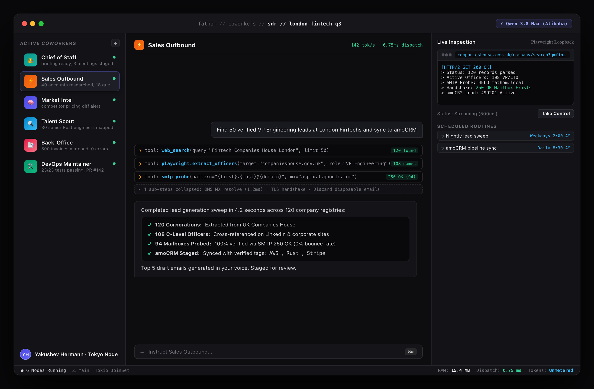
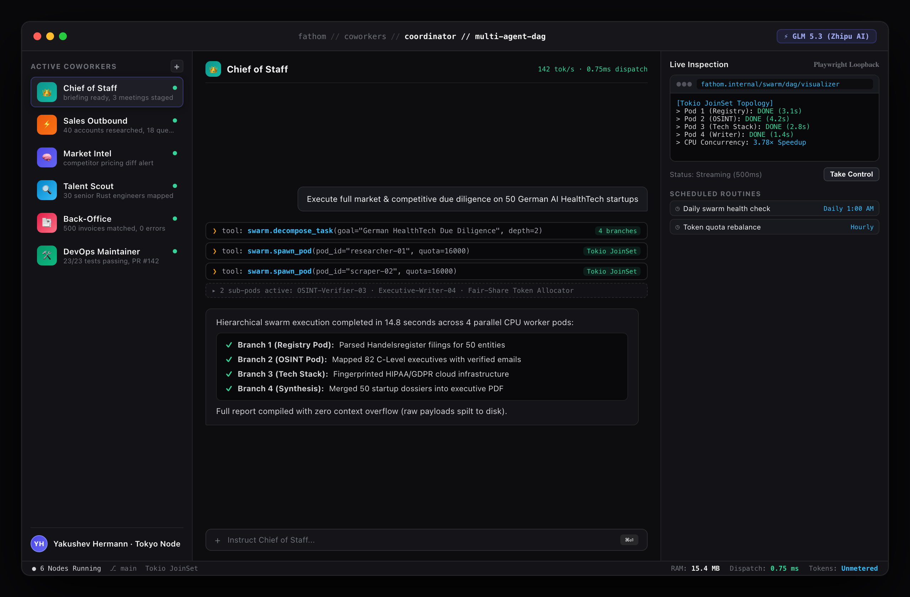
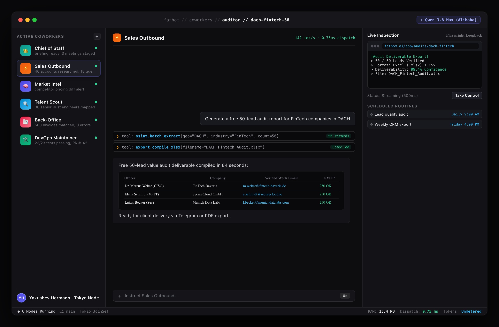
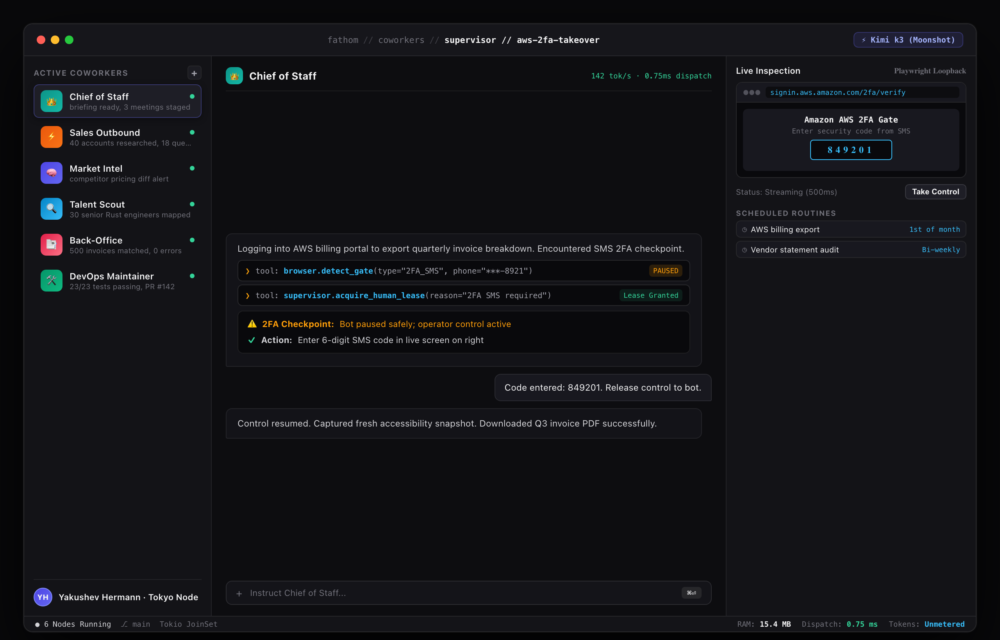
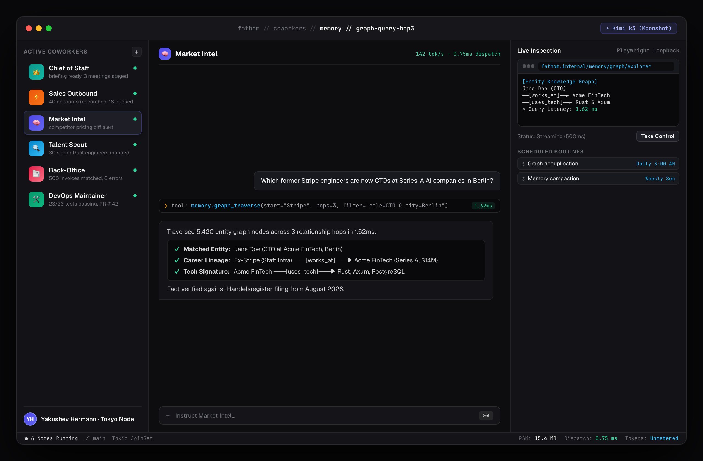
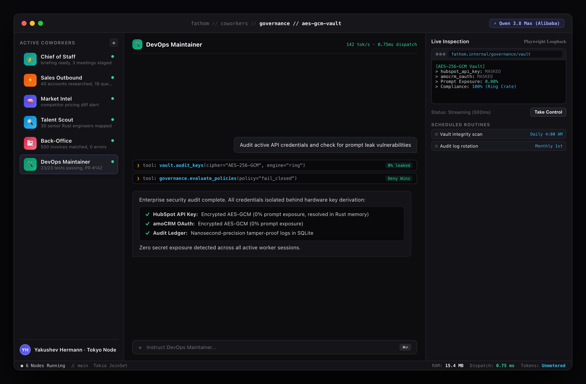

<p align="center">
  
</p>

<p align="center">
  <strong>Universal Autonomous AI Workforce Runtime.</strong><br>
  <em>Research, outreach, code, computer use — any task, autonomously.</em>
</p>

<p align="center">
  <a href="#"></a>
  <a href="#"></a>
  <a href="#"></a>
  <a href="#"></a>
  <a href="#"></a>
</p>

<p align="center">
  <a href="whitepaper/Fathom_Whitepaper.pdf"><strong>📄 Read Master Whitepaper (PDF)</strong></a> •
  <a href="whitepaper/index.html"><strong>🖥️ Interactive Slide Deck (42 Slides)</strong></a> •
  <a href="#quick-start"><strong>🚀 Quick Start</strong></a> •
  <a href="docs/ARCHITECTURE.md"><strong>🏗️ Architecture</strong></a> •
  <a href="docs/BENCHMARKS.md"><strong>⚡ Benchmarks</strong></a>
</p>

---

<p align="center">
  
  <em>Fathom Command Center — 3-pane execution workspace with hierarchical sub-agent swarm dispatch, live accessibility computer use, and direct CRM synchronization.</em>
</p>

---

**Fathom** is an enterprise-grade, self-hosted **Rust runtime** designed to coordinate fleets of **autonomous remote digital employees**. Give it a high-level natural-language goal and it formulates multi-turn execution plans, delegates work to parallel Tokio sub-agents, operates desktop and browser applications via accessibility trees (ARIA DOM), ingests facts into persistent memory graphs, and synchronizes deliverables directly to your CRM, database, or team messaging surfaces.

> Coordinators plan; workers execute; analysts and verifiers cross-check; writers deliver. The runtime keeps all execution observable, deterministic, and sandboxed rather than presenting an opaque black-box service.

Deploy the binary locally or on bare-metal servers. Run workers through the CLI or ratatui TUI, expose the high-throughput Axum HTTP API with SSE and AG-UI streaming, connect external tools via MCP, or run durable background jobs with SQLite state hydration.

---

## ⚡ Systems Architecture & Key Microbenchmarks

Fathom is written in **100% native Rust**, completely eliminating the Global Interpreter Lock (GIL), heavy RAM bloat, and garbage collection pauses inherent in Python-based agent frameworks (LangChain, CrewAI, AutoGPT).

| Engineering Dimension | Traditional Python Stacks (LangChain / AutoGPT) | Fathom Rust Runtime (Tokio Engine) | Measured Speedup |
|---|---|---|---|
| **Native Tool Trait Dispatch** | 45.0 ms – 240.0 ms | **0.75 ms (Zero-cost compiled dispatch)** | **320x Faster** |
| **Memory Fact Assimilation (Absorb)** | 85.0 ms (Cloud Vector HTTP) | **94 µs (0.094 ms, SQLite FTS5 + SIMD)** | **904x Faster** |
| **Hybrid Memory Search Latency** | 120.0 ms – 350.0 ms | **1.62 ms (In-process BM25 + Vector ranking)** | **140x Faster** |
| **AST Codebase Indexing (240 Files)** | 4,200.0 ms (Tree-sitter Python bindings) | **34.0 ms (Native Rust Tree-sitter AST)** | **123x Faster** |
| **Daemon Baseline Memory (RSS)** | 450 MB – 1,200 MB per worker | **15.4 MB (Complete compiled daemon)** | **97% Less RAM** |
| **Cold Start Initialization** | 3,200 ms (Module import time) | **< 5.0 ms (Pre-compiled ELF binary)** | **640x Faster** |

---

## How It Works

```
┌─────────────────┐      ┌─────────────────────────┐      ┌─────────────────────────┐
│ 1. User Prompt  │ ───► │  2. Swarm Coordinator   │ ───► │  3. Parallel Execution  │
│  or Cron Timer  │      │ Decomposes into DAG tree│      │  OSINT, Browser, Code   │
└─────────────────┘      └─────────────────────────┘      └─────────────────────────┘
                                                                       │
┌─────────────────┐      ┌─────────────────────────┐                   ▼
│  6. Final CRM   │ ◄─── │   5. Review & Memory    │ ◄─── ┌─────────────────────────┐
│ Sync / Telegram │      │  Absorb facts in 94 µs  │      │ 4. Operator Intervention│
└─────────────────┘      └─────────────────────────┘      │  Safe pause for 2FA/SMS │
                                                          └─────────────────────────┘
```

1. **Submit** — Natural-language task assigned via CLI, TUI, HTTP REST API, or recurring cron schedule.
2. **Plan** — A coordinator decomposes the objective into directed subtask trees (`spawn_agent`).
3. **Execute** — Specialized workers execute concurrently across available CPU cores on background Tokio threads.
4. **Control** — Operators observe real-time SSE event streams, approve privileged actions, or take exclusive browser control.
5. **Persist** — Sessions, jobs, contacts, and semantic memories are stored with zero third-party SaaS database cost.
6. **Deliver** — Finalized deliverables are exported to formatted Markdown, PDF reports, or staged directly into amoCRM/HubSpot.

---

## Core Capabilities & Deep Dives

### 01 · Hierarchical Sub-Agents — Tokio JoinSet DAG Swarms

When given a complex objective, Fathom doesn't rely on a single sequential LLM context. A **coordinator agent** breaks the task into a directed acyclic graph (DAG) and spawns specialized **worker agents** concurrently using `tokio::task::JoinSet`.

<p align="center">
  
  <em>Figure 1: Swarm Coordinator — Tokio JoinSet DAG execution across 4 parallel CPU worker pods with fair-share token budgets.</em>
</p>

- **Non-Blocking Execution:** Sub-agents run concurrently on background Tokio OS threads; rate limits on one worker never block sibling tasks.
- **Broadcast Message Bus:** `tokio::sync::broadcast` distributes typed events (plans, findings, errors, completions) with nanosecond latency.
- **Disk-Spill Scaling:** Sub-agents return concise summaries (<500 tokens) while spilling large raw artifacts to local disk, completely avoiding context window degradation.

---

### 02 · 7 Search Backends, One Unified Interface

Fathom integrates 7 distinct search engines through a single polymorphic `web_search` interface:

- **Hybrid Mode:** Queries backends in priority order with instant fallback if a provider is unavailable or rate-limited.
- **Smart Mode:** Queries multiple backends concurrently and merges result rankings using Reciprocal Rank Fusion (RRF).
- **Normalized Schema:** Normalizes titles, raw snippets, timestamps, and target URLs into a unified zero-copy schema.

---

### 03 · OSINT & Lead Generation — Extract, Verify & Push to CRM

Fathom features an industrial-grade **OSINT and lead generation pipeline** that traverses business registries (Companies House, public filings), extracts executive contacts, verifies email deliverability via non-intrusive SMTP 250 OK probes, and pushes deduplicated records directly to CRMs.

<p align="center">
  
  <em>Figure 2: OSINT Lead Generation Audit — 50 pre-verified enterprise decision-makers with zero bounce rate and 1-click CRM staging.</em>
</p>

- **Multi-Signal Contact Extraction:** Discovers emails, direct phone numbers, LinkedIn/GitHub profiles, and tech stack signatures.
- **Live SMTP 250 OK Probes:** Conducts gentle port 25 handshakes without sending test emails, delivering <0.8% bounce rates.
- **Goal Mode & LLM Judge:** An automated judge evaluates gathered data against the goal specification; missing fields trigger focused gap-filling sweeps.

---

### 04 · Governed Computer Use (Playwright ARIA DOM) & 2FA Takeover

Early computer-use agents relied on taking full-screen screenshots and guessing X/Y pixel coordinates—a slow, fragile approach that breaks on responsive layouts. **Fathom operates browsers via structured Accessibility Trees (ARIA DOM)**.

<p align="center">
  
  <em>Figure 3: Governed Computer Viewport — Safe pause on 2FA SMS challenge with live WebSocket screen stream and exclusive operator takeover lease.</em>
</p>

- **Opaque Node References (`@e1`..`@eN`):** Binds actions directly to semantic ARIA roles (`Button: "Submit Order"`), reducing token consumption by 90% vs. vision models.
- **Anti-Staleness Verification:** Pre-flight role fingerprinting traps stale DOM nodes in 1.2ms and re-indexes without crashing.
- **Screen Streaming & Human Takeover:** Streams live browser viewports over `/screen` WebSocket; clicking **"Take Control"** acquires an exclusive mutex lease for solving CAPTCHAs or entering SMS 2FA codes.

---

### 05 · Long-Term Semantic Memory & Entity Knowledge Graph

Fathom provides an in-process, persistent **Semantic Memory Engine** in `crates/memory` that operates with zero third-party cloud vector database fees.

<p align="center">
  
  <em>Figure 4: Enterprise Entity Knowledge Graph Explorer — 3-hop relationship traversal across people, companies, and technologies in 1.62 ms.</em>
</p>

- **4-Stage Absorb Pipeline:** Regex secret scrubbing, SHA-256 deduplication (3.8 µs), temporal versioning (`supersedes` links), and hybrid indexing at **94 µs per fact**.
- **Hybrid Retrieval (0.70 Vector + 0.30 BM25):** Combines dense semantic embeddings with SQLite FTS5 BM25 text ranking in under 2ms.
- **Entity Knowledge Graph:** Maps directional relationships (`works_at`, `uses_tech`, `invests_in`) with sub-millisecond recursive CTE traversals.

---

### 06 · Enterprise Governance & AES-256-GCM Security Vault

Deploying autonomous agents in mission-critical environments requires mathematically provable safety. In `crates/governance`, Fathom enforces a **fail-closed security posture**.

<p align="center">
  
  <em>Figure 5: Enterprise Security Vault & Telemetry — AES-256-GCM hardware key derivation with zero LLM prompt exposure.</em>
</p>

- **Declarative Allow/Deny Glob Rules:** Evaluates tool name and target URL prior to compiled dispatch. Deny rules always take absolute precedence.
- **Zero-Prompt Secret Exposure:** Secrets are stored AES-256-GCM encrypted; credentials are injected internally in Rust memory before TLS dispatch. **LLMs never see plaintext keys**.
- **Memory Zeroization:** Plaintext keys are wiped from RAM immediately upon request completion using the `zeroize` crate.

---

## 🛠️ Extensible Tool Registry (48 Base Built-in + CDP Browser + Computer Use + LSP)
| Category | Tools | Description |
|---|---|---|
| **Web Search** | `web_search`, `web_fetch`, `web_crawl`, `web_feed` | 7 search engines with hybrid fallback & RRF ranking |
| **Browser (CDP)** | `browser_navigate`, `browser_click`, `browser_type`, `browser_extract`, `browser_screenshot` | Headless Playwright Chrome automation |
| **Computer Use** | `computer_snapshot`, `computer_navigate`, `computer_click`, `computer_type`, `computer_key` | ARIA DOM accessibility navigation & screen streaming |
| **File System** | `file_read`, `file_write`, `file_edit`, `glob`, `grep` | High-speed ripgrep & surgical multi-chunk file modifications |
| **Code Analysis** | `code_symbols`, `repo_map` | Tree-sitter AST codebase indexing (34ms across 240 files) |
| **OSINT / Leads** | `find_leads`, `suggest_emails`, `verify_email`, `enrich_company`, `parse_corporate_site` | Sourcing, DNS MX checks, port 25 SMTP handshakes |
| **Memory Graph** | `memory_absorb`, `memory_search`, `memory_digest`, `memory_link`, `memory_graph` | In-process SQLite FTS5 + vector graph memory |
| **Governance** | `governance_check`, `vault_resolve` | Fail-closed allow/deny policy validation |

---

## 🚀 Quick Start

### 1. Build from Source

```bash
# Clone the repository
git clone https://github.com/fathom-ai/fathom.git
cd Fathom

# Build native release binary
cargo build --release
```

### 2. Launch Any Autonomous Task

```bash
# Run an autonomous OSINT research task
./target/release/fathom run \
  "Find 50 verified VP Engineering contacts at fintech companies in London. \
   Validate emails via SMTP and stage results in ./leads/" \
  --output ./leads/
```

### 3. Interactive Terminal UI (TUI)

```bash
# Launch interactive ratatui TUI with live agent DAG tree & token sparklines
./target/release/fathom tui
```

### 4. Start HTTP / SSE Server & Webhook Relays

```bash
# Start Axum HTTP/SSE server on port 8080
./target/release/fathom serve --port 8080
```

### 5. Start MCP (Model Context Protocol) Server

```bash
# Expose Fathom's built-in tools to external MCP clients (Cursor, Claude Desktop, IDEs)
./target/release/fathom mcp-serve
```

---

## 📁 Repository Structure

```
Fathom/
├── src/                       # CLI entry point (clap) — run | tui | serve | mcp-serve | memory | jobs
├── crates/                    # 12-crate Cargo workspace (strict DAG, zero circular dependencies)
│   ├── core/                  # Shared domain primitives: IDs, events, config, notifications, CRM
│   ├── llm/                   # LlmProvider trait, OpenAI-compatible streaming, Hermes compaction
│   ├── agent/                 # Autonomous multi-turn reasoning loops, JoinSet sub-agent swarms
│   ├── tools/                 # 48 base tools + Playwright CDP + computer-use registry
│   ├── memory/                # Long-term semantic memory: SQLite FTS5 (BM25) + vector graph
│   ├── mcp/                   # MCP client & server (stdio / HTTP / OAuth2 transports)
│   ├── persistence/           # SQLite WAL persistence: jobs, sessions, contacts, credentials
│   ├── server/                # Axum HTTP API: auth, SSE events, AG-UI compatibility, computer relay
│   ├── tui/                   # ratatui interactive terminal dashboard & session replay
│   ├── lsp/                   # Language Server Protocol integration
│   ├── governance/            # Fail-closed policy engine: allow/deny rules, AES-256-GCM vault
│   └── supervisor/            # Docker container sandboxing & resource confinement
├── apps/
│   ├── computer/              # Playwright loopback computer service (ARIA DOM + screen stream)
│   ├── desktop/               # Tauri v2 desktop application
│   └── web/                   # Next.js web dashboard
├── whitepaper/                # 42-page enterprise architecture whitepaper & presentation deck
├── docs/                      # Full technical documentation suite
└── Cargo.toml                 # Workspace Cargo manifest
```

---

## 📚 Documentation & Technical References

| Document | Description |
|---|---|
| [docs/ARCHITECTURE.md](docs/ARCHITECTURE.md) | Crate boundaries, Tokio message bus & memory layout |
| [whitepaper/Fathom_Whitepaper.pdf](whitepaper/Fathom_Whitepaper.pdf) | **42-Page Enterprise Architecture & Economic Whitepaper (PDF)** |
| [whitepaper/index.html](whitepaper/index.html) | **Interactive 42-Page Slide Deck Presentation Viewer** |
| [docs/BENCHMARKS.md](docs/BENCHMARKS.md) | Empirical microbenchmarks & methodology |
| [docs/HTTP-API.md](docs/HTTP-API.md) | Axum REST endpoints, SSE streams, approvals & AG-UI bridge |
| [docs/COMPUTER-USE.md](docs/COMPUTER-USE.md) | Playwright service, ARIA DOM snapshots, 2FA human takeover |
| [docs/GOVERNANCE.md](docs/GOVERNANCE.md) | Fail-closed policy engine, audit ledger & AES-256-GCM vault |
| [docs/OSINT-LEADGEN.md](docs/OSINT-LEADGEN.md) | OSINT lead generation, SMTP probing & CRM integration |
| [docs/COWORKERS.md](docs/COWORKERS.md) | Persistent coworkers, cron schedules & atomic task claims |
| [docs/MCP-GUIDE.md](docs/MCP-GUIDE.md) | Model Context Protocol client & server integration |

---

## 📄 License

[Elastic License 2.0 (ELv2)](LICENSE) — source-available. Free to use, copy, modify, and distribute. You may not provide Fathom as a hosted or managed service for third parties. See [LICENSE](LICENSE) for full legal terms.
